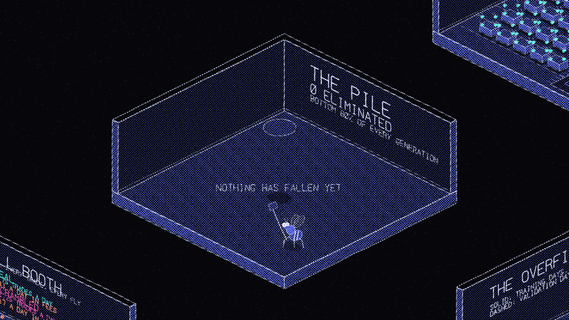
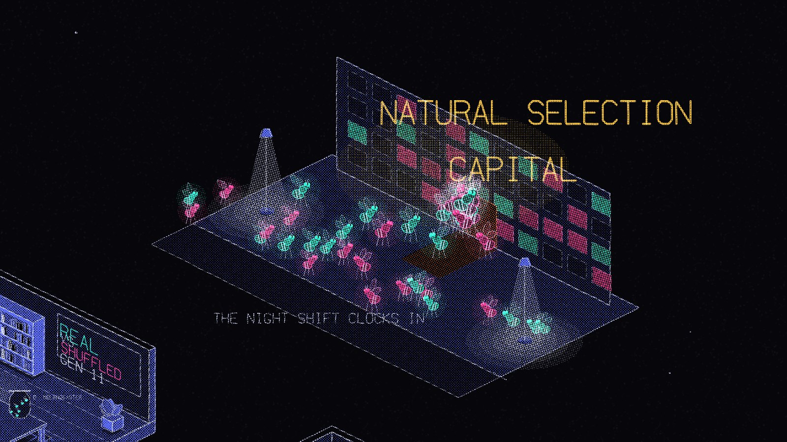
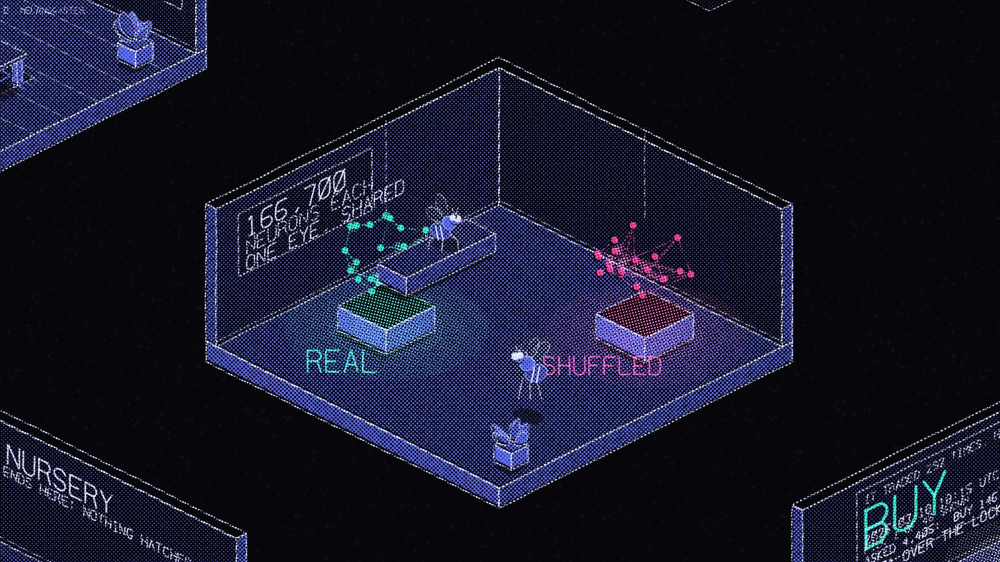
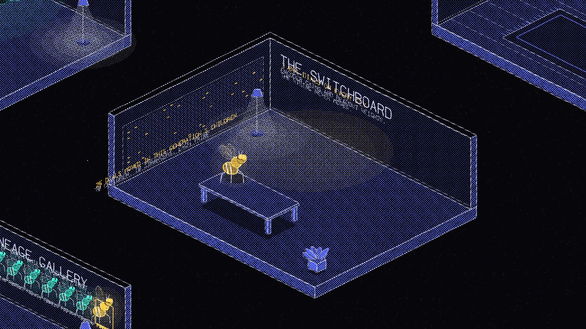
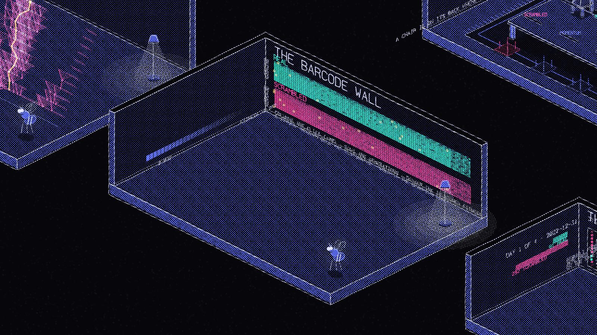
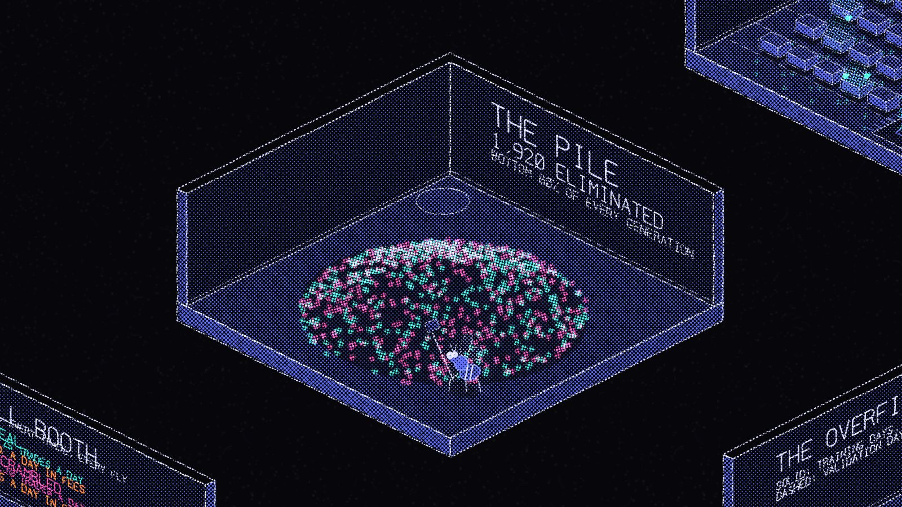
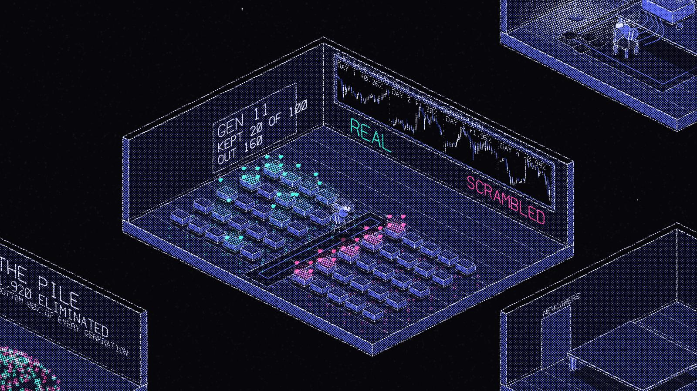
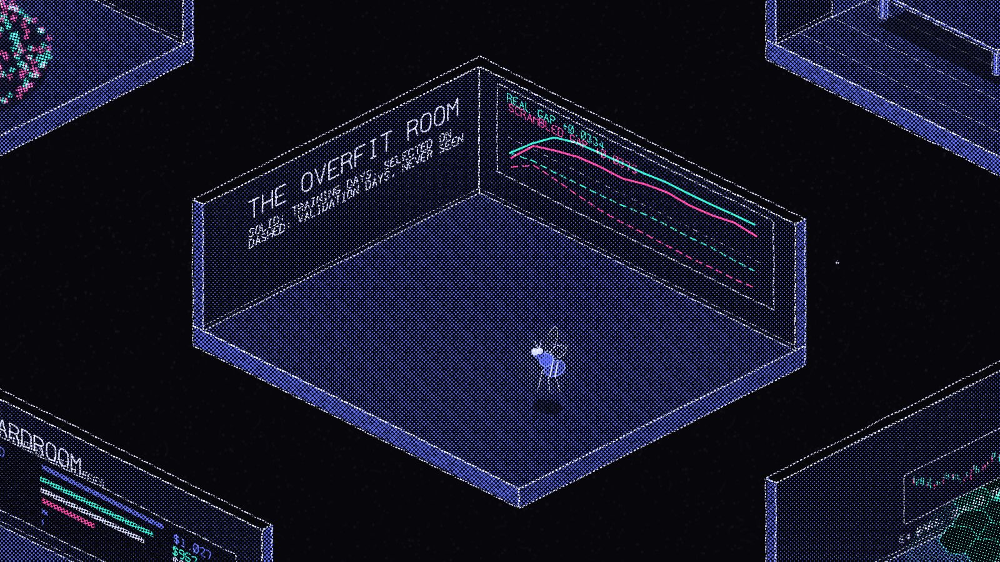
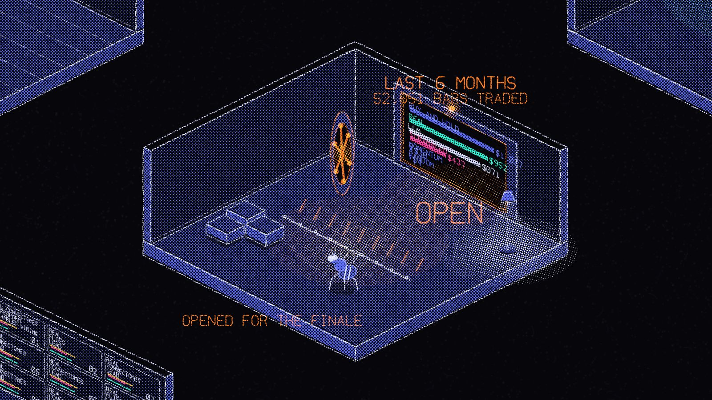

# Hedgefly: Natural Selection Capital

100 frozen fruit-fly brains, wired exactly like a real fly's, evolve to trade Bitcoin against a
tribe whose wiring was scrambled, then face six months of prices none of them has ever seen.



**Walk through it yourself:** <https://tacdelgineer.github.io/hedgefly/> (drag to look around,
number keys jump between rooms, I for the key list and credits)

**Watch the video:** YOUTUBE_LINK

The brains come from the MaleCNS v1.0 connectome and never change. Only the genome that connects
market data to the brain, and brain output to trades, evolves. The run is told as a building of
isometric rooms drawn entirely in code, and every number on its walls is read from the logs in
`runs/`. See [PLAN.md](PLAN.md); its non-negotiable rules apply to every change.

## The building

<table>
<tr>
<td width="50%"><br><b>The Street.</b> The building at night, and the swarm arriving for the shift.</td>
<td width="50%"><br><b>The Brain Room.</b> The fly's own wiring, and the same wiring shuffled.</td>
</tr>
<tr>
<td><br><b>The Switchboard.</b> The genome: every dial a fly inherits, and the few a child had changed.</td>
<td><br><b>The Barcode Wall.</b> One column per fly, one row per generation: the whole run as a barcode.</td>
</tr>
<tr>
<td><br><b>The Pile.</b> Every fly that failed to make the cut. It only ever grows.</td>
<td><br><b>The Trading Floor.</b> Two wings of fly traders, real and scrambled, over the four training days.</td>
</tr>
<tr>
<td><br><b>The Overfit Room.</b> The days the flies were picked on, against a surprise exam they never saw.</td>
<td><br><b>The Vault, open.</b> The six locked months, and every trader's final score.</td>
</tr>
</table>

## Results

Every figure below is read from the run files in `runs/`. Money is what $1,000 became,
rounded to the dollar the way the video's stat cards round it.

**Evolution works on the days it is trained on** (`runs/day6_full`, 20 generations, 100 flies
per tribe, the same four days every generation, 25.6 minutes per generation on one DGX Spark).
The typical real fly went from $989 to $1,028 a day and the typical scrambled fly from $985 to
$1,022, against $1,005 for just holding Bitcoin on those days. Both tribes learned to sit
still: the typical real fly's trades per day fell from 7.75 to 2.5, the scrambled one's from
31.25 to 9.75.

**Much of it is memorizing** (`runs/day7_validation`, 12 generations, plus two days no fly is
ever picked on). By the last generation the typical real fly made $1,026 on its training days
but $992 on the surprise exam, where just holding Bitcoin also made $992. The typical scrambled
fly: $1,017 against $980.

**The final test: the vault** (`runs/day6_full/finale.json`). The top 10 flies of each tribe
from the last generation traded six locked months, 18 March to 17 September 2026 (52,851
five-minute bars), once, at 5 basis points a side:

| Trader | With fees | Fees switched off |
|---|---:|---:|
| Real champions (average of 10) | $952 | $1,192 |
| Scrambled champions (average of 10) | $437 | $1,066 |
| Just holding Bitcoin | $1,027 | $1,027 |
| Local AI model (qwen3.6:35b-a3b, asked hourly) | $871 | $1,008 |
| Momentum robot | $38 | $1,002 |
| Random robot | $4.43 | $883 |

- With fees, every real champion finished above every scrambled champion. The real ones made
  about 450 trades each over the six months; the scrambled ones about 1,788, and paid the fee
  on every one.
- With fees, 2 of the 10 real champions beat just holding Bitcoin. With the fees switched off,
  all 10 did.
- Not financial advice. It's an experiment.

## How to run it

Built for a DGX Spark (ARM64, GB10, CUDA 13). Environments are managed with uv only.

```bash
uv sync
uv run python -c "import torch; assert torch.cuda.is_available(), 'CPU-only torch'"
```

Download the connectome (CC BY 4.0, about 1.1 GB) into `data/` (gitignored):

```bash
B=https://storage.googleapis.com/flyem-male-cns/v1.0/connectome-data/flat-connectome
curl -o data/body-annotations.feather       $B/body-annotations-male-cns-v1.0-minconf-0.5.feather
curl -o data/body-neurotransmitters.feather $B/body-neurotransmitters-male-cns-v1.0.feather
curl -o data/connectome-weights.feather     $B/connectome-weights-male-cns-v1.0-minconf-0.5.feather
```

The first load filters the weights table and caches it in `data/cache/` (about 25 s).

Download the candles. BTC-USD 5-minute bars; the last 6 months are split into a separate file
that only `finale.py` ever opens (PLAN.md rule 3):

```bash
uv run python -m market.fetch_btc --start 2022-09-01
```

Brain speed benchmark (ms per brain step by population and subset, GPU only):

```bash
uv run scripts/bench.py
```

Evolve (writes `runs/<run_id>/`, one log and one summary per generation):

```bash
uv run python -m scripts.run_evolution --generations 3
uv run python -m scripts.check_sensitivity        # do enough flies react to the chart?
```

Validation run (two more days, never selected on, to measure memorizing):

```bash
uv run python -m scripts.run_evolution --generations 12 --val-windows 2 --run-id day7_validation
```

The finale opens the six locked months, so run it once, for real. `--rehearse N` trades the
last N bars of the evolve set instead, so the rig can be tested without seeing the ending. The
flies need the GPU and the model needs a local OpenAI-compatible endpoint (`--llm-url`), so they
are two scripts, merged afterwards:

```bash
uv run python finale_flies.py --run runs/day6_full
uv run python finale_llm.py --run runs/day6_full --llm-model qwen3.6:35b-a3b
uv run python finale_merge.py --run runs/day6_full
```

Export the logs for the visuals, then build and film the world (see [The world](#the-world)):

```bash
uv run python -m scripts.export_for_visuals --run runs/day7_validation --finale runs/day6_full
```

## A deliberate fairness choice: both tribes use the real fly's eye

The scrambled tribe is the control that says whether the fruit fly's actual wiring matters, so
the two tribes must differ in the wiring and in nothing else (PLAN.md rule 6).

One thing that looks like wiring but is not: the **eye layout**. Photoreceptors carry no
coordinate in the MaleCNS release, so nfly places each one at the synapse-weighted mean hex
coordinate of its columnar targets - that is, it computes where a photoreceptor looks *from the
edges*. Scrambling the edges scatters the photoreceptors at random across the chart.

Handing the scrambled tribe an eye built from its own scrambled edges would therefore not test
its wiring, it would blindfold it, and the real tribe would win a race against an opponent that
cannot see. **Both tribes are built with the photoreceptor layout computed from the real
connectome** (`brain.build_eye`, passed to `TribeAgent.build(..., eye=...)`), and the readout
groups both tribes vote through come from the release's annotations rather than from the edges
for the same reason. What the scrambled tribe loses is the circuit between the eye and the
readout - which is the thing under test.

Tested in `tests/test_fairness.py`: an eye built from scrambled edges really does land
somewhere else, and the two tribes really are built with the same one.

## Dependencies

- `nfly` is pinned to commit `82d227eed4a35cd261f81d202e0d30458c9e4e73` in `pyproject.toml`
  (`[tool.uv.sources]`). Change the pin on purpose, never by accident.
- `gymnasium` is a direct dependency because `import nfly` imports it (`nfly/agent.py`),
  even though nfly only declares it in its `games` extra.

## The world

**Natural Selection Capital HQ** is the run as a place: isometric cutaway rooms in a neon
risograph look, drawn entirely in code on one canvas, replaying `runs/<run_id>/` room by room.
Published from `gh-pages`: <https://tacdelgineer.github.io/hedgefly/>

- Source: `visuals/hq2/index.html`, over the shared core in `visuals/lib/neon-riso.js`.
- Data: `visuals/hq/runs.json`, written only by `scripts/export_for_visuals.py`
  (`visuals/hq/data-contract.md`, v4). The page replays it and never re-runs anything.
- One file: `node scripts/build_standalone.mjs` inlines the core and the data into
  `visuals/dist/hedgefly.html`, which opens by double-click with no server.
- 23 rooms, and three ways to look at the whole building: **K** the blueprint plan, **O** the
  dollhouse section, **N** night-to-day light tied to the generation. **I** opens the About
  panel; the full key list is in the legend and in that panel.
- Film: `node scripts/record_hq.mjs`, `record_extra.mjs`, `record_rooms.mjs` and
  `record_new.mjs` write PNG frames plus mp4, wide and vertical, into `results/film*`.
  `results/final_footage/{wide,vertical}` collects all 40 of those mp4s under names that put
  them in script order; `ORDER.txt` there says which reel each one came from. Both cuts run
  7:10.8. Untracked, like the reels it is copied from.
- Checks: `node scripts/smoke_rooms.mjs` draws every room and view once and fails on anything
  that throws; `node scripts/test_director.mjs` presses every director key in the built file.

One script re-runs the simulation for the visuals rather than replaying it, and it is the only
one: `scripts/replay_champions.py`, for the Replay Room. The margins a fly decides on and the
readout groups behind them are never written to a generation log, so it re-runs the two final
champions on one day of the **evolve** set and writes them down, which is what keeps rule 8
true for that room. It checks itself against the actions the run logged.

## Credits

- **MaleCNS v1.0 connectome.** Berg, S., Beckett, I. R., Costa, M., Schlegel, P., Januszewski, M.,
  Marin, E. C., Nern, A., et al. *Sexual dimorphism in the complete connectome of the Drosophila
  male central nervous system.* Cell (2026).
  [doi:10.1016/j.cell.2026.08.015](https://doi.org/10.1016/j.cell.2026.08.015).
  Data from FlyEM (HHMI Janelia Research Campus) and collaborators, released under
  [CC BY 4.0](https://creativecommons.org/licenses/by/4.0/): <https://male-cns.janelia.org/>.
- **nfly** by Zhengxu Yu, <https://github.com/zhengxuyu/nfly>, MIT License. Connectome loader and
  rate-based brain dynamics.
- **creative-skills** by IshaanKalra2103, <https://github.com/IshaanKalra2103/creative-skills>,
  MIT License. The `riso-rooms` and `hand-drawn-canvas-animation` skills used for the visuals.
- The visual style is inspired by Kevin Ngo's "a small light, room by room" and his "life of a
  fruit fly" animation ([@kevin_t_ngo](https://twitter.com/kevin_t_ngo)). Inspiration only; no
  artwork, scenes or frames are copied, and every mark in this repo is drawn in code.

The short form, as it appears in the world's About panel and in `skills/neon-riso-fly/SKILL.md`:

> Visual style inspired by Kevin Ngo's "a small light, room by room" and his "life of a fruit fly" animation (@kevin_t_ngo). Built with the riso-rooms and hand-drawn-canvas-animation skills by IshaanKalra2103 (MIT). Connectome: MaleCNS v1.0 (Berg et al., Cell 2026). Brain simulator: nfly (MIT).
